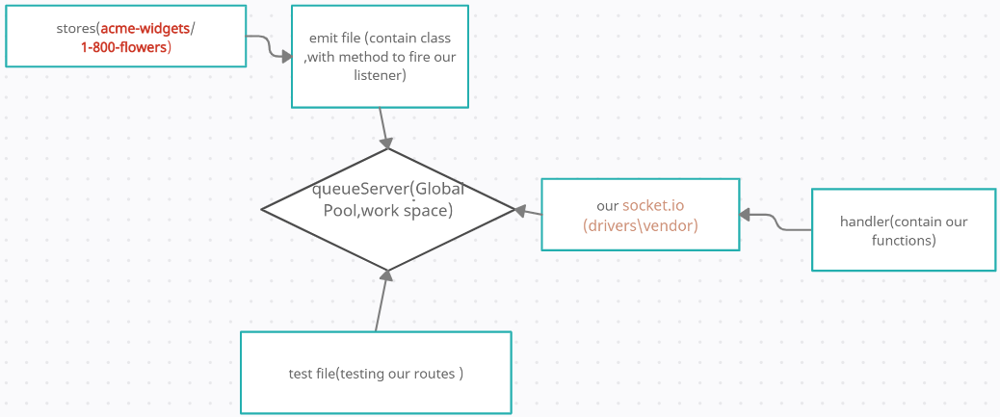

# caps

- [tests report](https://github.com/marwanrawshedh/caps/actions)
# Setup
- env requirements
 - Port Number
# Running the app
- node server.js
- node vendor.js
- node driver.js
- node emit.js
# Tests
- Unit Tests: npm run test
# uml 

# terminal
